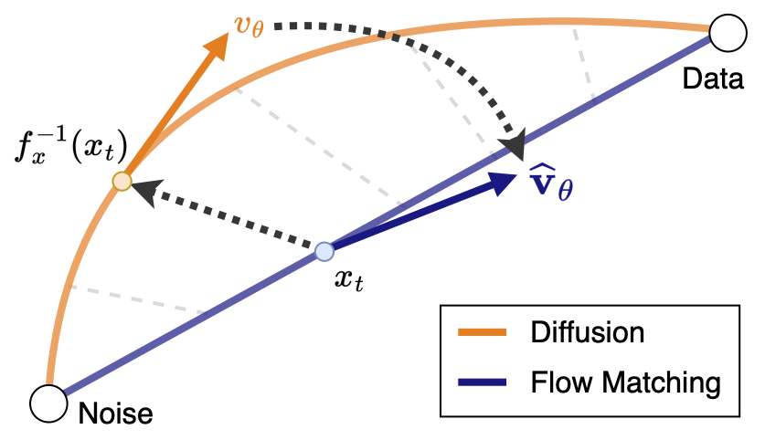
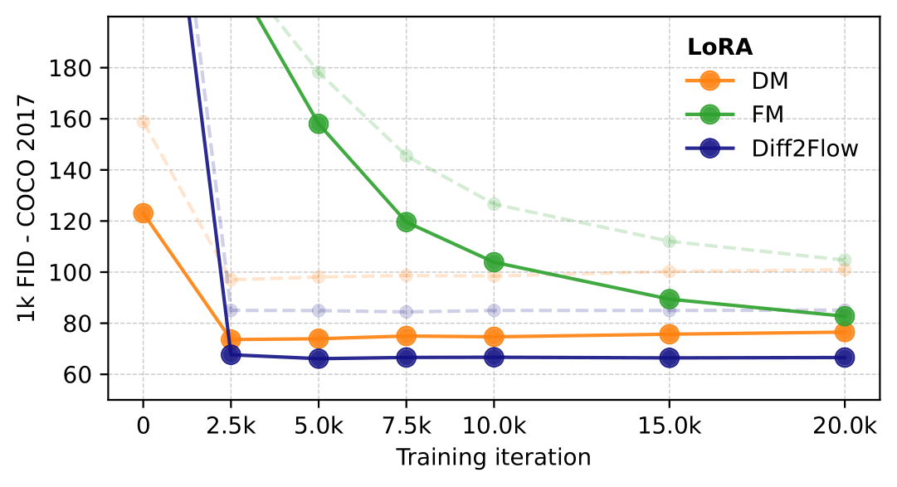
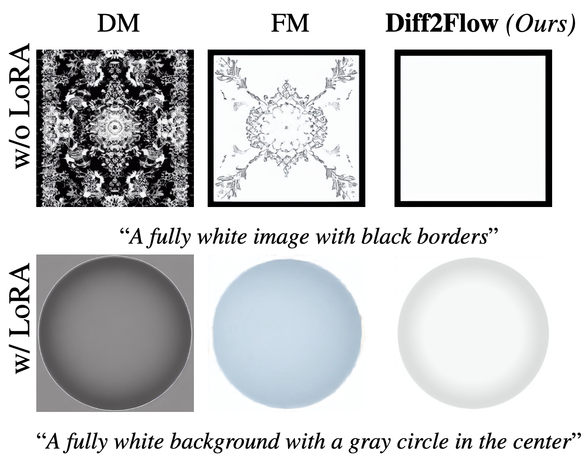
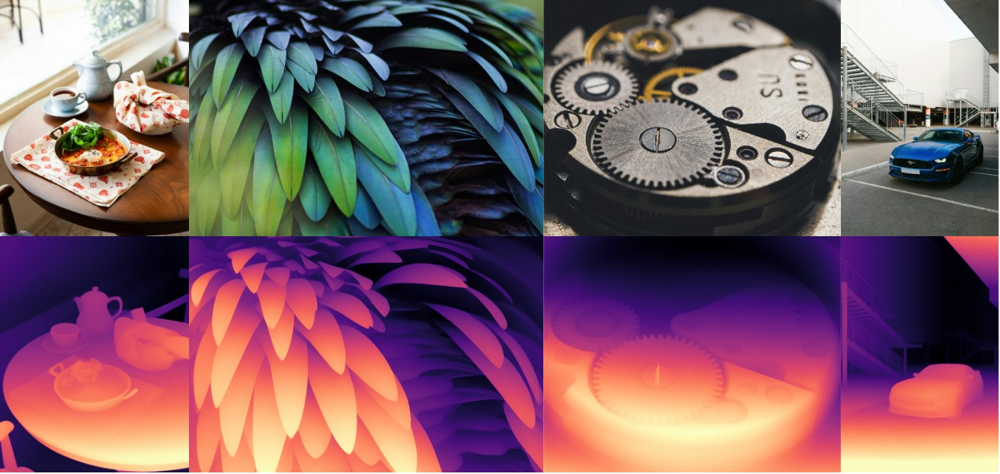
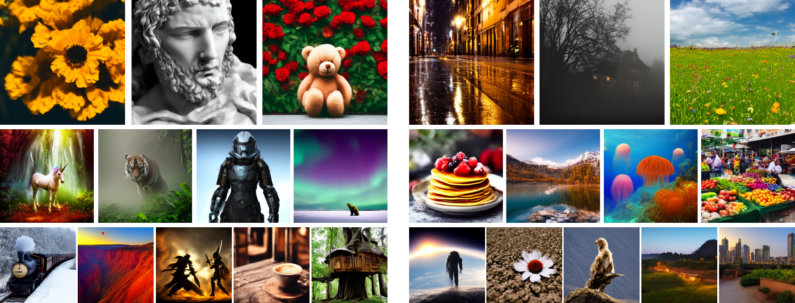

<div align="center">

<h2>🌊 Diff2Flow: Training Flow Matching Models via Diffusion Model Alignment</h2>

<p>
  <strong>Johannes Schusterbauer<sup>*</sup>, Ming Gui<sup>*</sup>, Frank Fundel, Björn Ommer</strong><br>
  <em>CompVis Group @ LMU Munich</em><br>
  <sup>*</sup><i>Equal contribution</i>
</p>

<p><strong>📄 CVPR 2025</strong></p>

<a href="https://arxiv.org/abs/2506.02221" target="_blank">
  
</a>

</div>


## 🔥 TL;DR

We propose **Diff2Flow**, a framework that bridges Diffusion and Flow Matching (FM) paradigms by *rescaling timesteps, aligning interpolants,* and *deriving FM-compatible velocity fields*. This alignment enables efficient FM finetuning of diffusion priors, retaining their knowledge while unlocking the inference efficiency and performance benefits of Flow Matching.


## 📝 Overview

Diffusion models have revolutionized generative tasks through high-fidelity outputs, yet flow matching (FM) offers faster inference and empirical performance gains. However, current foundation FM models are computationally prohibitive for finetuning, while diffusion models like Stable Diffusion benefit from efficient architectures and ecosystem support. 

<p align="center">

</p>

This work addresses the critical challenge of efficiently transferring knowledge from pre-trained diffusion models to flow matching. We propose Diff2Flow, a novel framework that systematically bridges diffusion and FM paradigms by rescaling timesteps, aligning interpolants, and deriving FM-compatible velocity fields from diffusion predictions. This alignment enables direct and efficient FM finetuning of diffusion priors with no extra computation overhead. Our experiments demonstrate that Diff2Flow outperforms naive FM and diffusion finetuning particularly under parameter-efficient constraints, while achieving superior or competitive performance across diverse downstream tasks compared to state-of-the-art methods.


## 📈 Results

We show our method on various fine-tuning tasks, e.g. adapting a model to a new resolution or dataset, transfering knowledge to a new domain (image-to-depth), and even speeding up inference by performing reflow.

### Resolution Adaptation

When sampling from a diffusion model at a resolution different from its training resolution, performance often degrades due to the model being optimized for a fixed “sweet spot.” With Diff2Flow, adapting a pre-trained diffusion model to a new resolution becomes straightforward and efficient. Our method enables rapid finetuning, allowing the model to generate high-quality outputs at the target resolution without significant overhead. This adaptation remains effective even under LoRA constraints, outperforming both standard diffusion finetuning and naïve flow matching approaches.

<p align="center">

</p>

An added benefit of our framework is that it also helps mitigate the non-zero terminal SNR issue common in diffusion models. Because the final timestep does not completely remove signal, these models typically struggle with prompts that require extreme uniformity (e.g., fully black or white images). With minimal finetuning using our approach, the model learns to align better with such prompts, producing cleaner, artifact-free outputs even in these edge cases.

<p align="center">

</p>


### Image-to-Depth

We can further leverage the diffusion prior to perform generative monocular depth estimation by finetuning the base model on synthetic data. Given a single image, our approach allows for the generation of accurate depth maps with just very few training iterations. This is highly efficient, enabling fast adaptation to depth estimation without requiring extensive training.

<p align="center">

</p>


### Reflow

Flow Matching models support Reflow, a technique that straightens sampling trajectories and enables rapid image generation. Diffusion models cannot directly leverage this method. With our approach, we enable Reflow for diffusion models, allowing very efficient few-step inference and significantly speeding up the generation process.

For example, we could only use **4** (left) or even as few as **2** (right) inference steps to generate visually pleasing images from text.

<p align="center"></p>


## 🛠️ Setup

Just create the environment using `conda`

```bash
conda env create -f environment.yml
conda activate d2f
```

Make sure to have a folder in this directory which includes all the neccessary checkpoints, e.g. the autoencoder checkpoint for the first stage model, SD1.5, etc. You can download the checkpoints as follows:

```bash
mkdir checkpoints
cd checkpoints

# SD 1.5 checkpoint
wget -O v1-5-pruned.ckpt https://huggingface.co/stable-diffusion-v1-5/stable-diffusion-v1-5/resolve/main/v1-5-pruned.ckpt?download=true

# SD 2.1 checkpoint
wget -O v2-1_768-ema-pruned.ckpt https://huggingface.co/stabilityai/stable-diffusion-2-1/resolve/main/v2-1_768-ema-pruned.ckpt?download=true

# SD-VAE checkpoint
wget -O sd_ae.ckpt https://www.dropbox.com/scl/fi/lvfvy7qou05kxfbqz5d42/sd_ae.ckpt?rlkey=fvtu2o48namouu9x3w08olv3o&st=vahu44z5&dl=0

# TinyAutoencoderKL checkpoints
wget https://github.com/madebyollin/taesd/raw/refs/heads/main/taesd_encoder.pth
wget https://github.com/madebyollin/taesd/raw/refs/heads/main/taesd_decoder.pth

# nulltext openclip embedding
wget -O nulltext_openclip_embedding.npy https://www.dropbox.com/scl/fi/6yq31ho8vntz7bbvu3ad2/nulltext_openclip_embedding.npy?rlkey=gcy6vtdg61u6fdhavvxsixebx&st=xf9gxhdz&dl=0
```


## 🚀 Usage

In general, the `config.yaml` file specifies the default. The configs are split into 5 submodules:

- `autoencoder`: specifies which first stage to use (either standard one or Tiny Autoencoder)
- `data`: specifies the data
- `lora`: contains different LoRA configs
- `model`: the specific model architecture (SD 2.1 with either 4 or 8 input channels), as well as the objective function (diffusion, FM, or Diff2Flow)
- `task`: specifies the conditioning information as well as the visualizer and metric tracker configs

You can overwrite one of the 5 modules via `<module>=...`. For example, `data=hypersim` changes the data to the hypersim config. The dot notation allows you to dynamically set different values from the config. For example, if you want to change the batch size, you can type `data.params.batch_size=2`. Since modifying multiple parameters via CLI can be cumbersome, there is also the `experiment` folder, where you can add config files. Then simply run a specific experiment via

```bash
python train.py experiment=<your-experiment>
```

**Info**: Appending `--info config` to your command shows you the final resulting config.

You can find some example configs in the `configs/experiment` folder (incl. image-to-depth, reflow, and text-to-image configs). In general, you need to setup a task (`configs/task`) to define the conditioning (cross-attention) and context (concatenation). For example, for image-to-depth, we set the context key to the original image latent, and set the conditioning stage to be a dummy clip embedder, which returns the nulltext embedding. The task config allows you to additionally setup a metric tracker and a visualizer.

For the experiments of the paper, you need to download (e.g. Hypersim) or create the datasets (reflow SD1.5 image-noise pairs). You can then run one of the configs just by replacing the respective dataset, e.g., `python train.py experiment=img2depth/obj_base data=hypersim` for monocular depth estimation. Currently, there are dummy datasets provided that specify what the inputs and outputs are.

## 🎓 Citation

If you use our work in your research, please use the following BibTeX entry

```bibtex
@InProceedings{schusterbauer2024diff2flow,
      title={Diff2Flow: Training Flow Matching Models via Diffusion Model Alignment},
      author={Johannes Schusterbauer and Ming Gui and Frank Fundel and Björn Ommer},
      booktitle={Proceedings of the IEEE/CVF Conference on Computer Vision and Pattern Recognition},
      year={2025}
}
```
